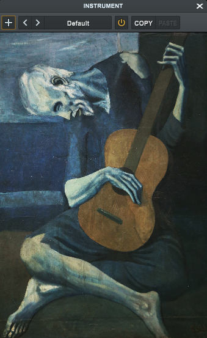

<h1>Old Guitarist</h2>

<p align="center"></p>

<br>

<p>
    Old guitarist is a physically modeled virtual guitar plugin.
</p>

## Features
- [x] Wave equation
- [ ] Stability condition
- [ ] Multiple Strings
- [x] IR Convolution
- [ ] Time-varying tension factor

## Physical Model

### Wave equation
Wave equation for a guitar string is given as:

$$
\begin{align*}
\frac{\partial^2 y}{\partial t^2} = \frac{T(t)}{\mu} \frac{\partial^2 y}{\partial x^2} - 2\sigma_0 \frac{\partial y}{\partial t} + \sigma_1 \frac{\partial}{\partial t}\left(\frac{\partial^2 y}{\partial x^2}\right) + EI \frac{\partial^4 y}{\partial x^4}
\end{align*}
$$
<br>

- $T(t)$: tension of the string at time $t$
- $\mu$: linear density of the string
- $\sigma_0$: frequency-independent damping factor
- $\sigma_1$: frequency-dependent damping factor
- $E$: Young's modulus of the string material
- $I$: second moment of area ($\frac{\pi r^4}{4}$ for a cylinder)

### Boundary Condition
$$
\begin{align*}
y(0, t) = y(L, t) = 0
\end{align*}
$$

- $L$: Length of the string

### Finite Difference
Consider the expression given by

$$
\begin{align*}
f' = \lim_{{h \to 0}} \frac{{f(x + h) - f(x)}}{h}
\end{align*}
$$

In the context of the finite difference method, $h$ is a finite interval, and the difference quotient is used to approximate the derivative. Instead of taking the limit as $h$ approaches zero, a small but finite value of $h$ is chosen.

The wave equation is discretized to obtain the following form with $\text{Spatial resolution} = \frac{1}{\Delta x}$ and $\text{Spatial resolution} = \frac{1}{\Delta x}$.

$$
\begin{align*}
\begin{split}
y_{i}^{m+1} = &\ (1 + \Delta x \sigma_0)^{-1} \bigg(2y_{i}^{m} - y_{i}^{m-1} \frac{T(t)}{\mu} \frac{\Delta t^2}{\Delta x^2} \left(y_i-1^{m} - 2y_{i}^{m} + y_{i+1}^{m}\right) \\
& - E I \frac{\Delta t^2}{\Delta x^4} \left(y_{i+2}^{m} - 4y_{i+1}^{m} + 6y_{i}^{m} - 4y_{i-1}^{m} + y_{i-2}^{m}\right) \\
& + \Delta t \sigma_0 y_{i}^{m-1} \\
& + \sigma_1 \frac{\Delta t}{\Delta x^2} \left(y_{i+1}^{m} - 2y_{i}^{m} + y_{i-1}^{m} - y_{i+1}^{m-1} + 2y_{i}^{m-1} - y_{i-1}^{m-1}\right) \bigg)
\end{split}
\end{align*}
$$

- $i$: Position along the string ($\Delta x$)
- $m$: Time step ($\Delta t$)

$y_{i}$ is sampled at each time step $m$ at $i=L/2$ for audio generation.

### Stability condition
The stability analysis of finite difference schemes when applied to the numerical solution of partial differential equations is intricately tied to the Courant–Friedrichs–Lewy (CFL) condition, expressed as:

$$
\begin{align*}
C = \sqrt{\frac{\mu}{T}} \frac{\Delta x}{\Delta t} \leq C_{\text{max}}
\end{align*}
$$

$$
\text{Spatial Resolution} \leq \text{Temporal Resolution} \times \sqrt{\frac{\mu}{T}}
$$

### Convolution with Impulse Response

An impulse response of an actual guitar is convoluted with the signal to introduce body resonance.

**Impulse response:** [Source](https://ccrma.stanford.edu/~jiffer8/420/project.html)

<audio controls>
  <source src="Source\Assets\impulse_response.wav" type="audio/wav">
</audio>

Instead of multiplication in frequency domain ($Y=XH$), same result can be achieved by convolution ($y=x*h$) in time domain. The formula for convolution is given as:

$$
(x * h)(t) = \int_{-\infty}^{\infty} x(\tau) h(t - \tau) \, d\tau
$$

- $x$: Input signal
- $h$: Impulse response
- $y$: Output signal
- $X$: Input signal's fourier transform
- $H$: Impulse response's fourier transform
- $Y$: Output signal's fourier transform

## Installation
### VST3 Installation (Windows)

1. **Download the Plugin:** Download old.guitarist.vst3 from [releases](https://github.com/enter-opy/old-guitarist/releases).

2. **Install the Plugin:**
   - **Copy the file into your DAW's plugin directory.**
   - **Rescan Plugins:** Follow your DAW's instructions to rescan plugins or manually add the plugin if necessary.

### Build from Source
To build Old guitarist from source:

1. **Clone the Repository:**
   ```bash
   git clone https://github.com/enter-opy/old-guitarist.git
   cd old-guitarist
2. **Install Dependencies:**
   - **Windows:** Make sure you have Visual Studio installed with the necessary components for C++ development.
   - **Mac:** Make sure you have Xcode installed with the command line tools.

3. **Build the Plugin:**

   **Windows:**
   - Open the project in Visual Studio.
   - Set the build configuration to `Release`.
   - Build the project by selecting `Build > Build Solution`.

   **Mac:**
   - Open the project in Xcode.
   - Set the scheme to `Release`.
   - Build the project by selecting `Product > Build`.
## Usage
- **Insert Plugin:** Load Old guitarist plugin into your preferred digital audio workstation (DAW).
- **Play the instrument:** Use a MIDI keyboard or your DAW's pianoroll to play the instrument.

## Contributing
Contributions to Old guitarist are welcome! If you'd like to contribute, follow these steps:
1. **Fork the Repository:** Start by forking the [Old guitarist repository](https://github.com/enter-opy/old-guitarist).
2. **Make Changes:** Create a new branch, make your changes, and commit them to your branch.
3. **Create a Pull Request:** Push your changes to your fork and submit a pull request to the original repository.
## License
This project is licensed under the GNU General Public License. See the [LICENSE](https://github.com/enter-opy/old-guitarist/blob/main/LICENSE) for details.

<h2><u>References</u></h2>

- Ka-Wing Ho, Yiu Ling & Chuck-jee Chau (2021). [Guitar Virtual Instrument using Physical Modelling with Collision Simulation](https://www.researchgate.net/publication/346562874_Guitar_Virtual_Instrument_using_Physical_Modelling_with_Collision_Simulation).</a><br>
- M. Shuppius (2017). [Physical modelling of guitar strings](https://www.youtube.com/watch?v=sxt5rxF_PdI).
</ul>